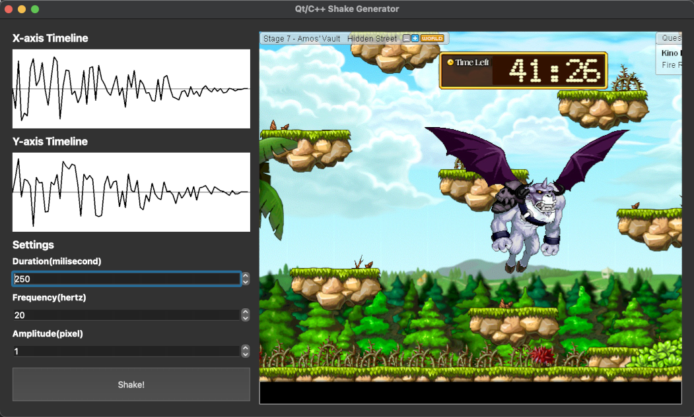

# Shake Generator Qt/C++
A simple application for visualizing the shake effect, enabling dynamic real-time animations. It is based on [this article](http://jonny.morrill.me/blog/view/14).

## Screenshots

